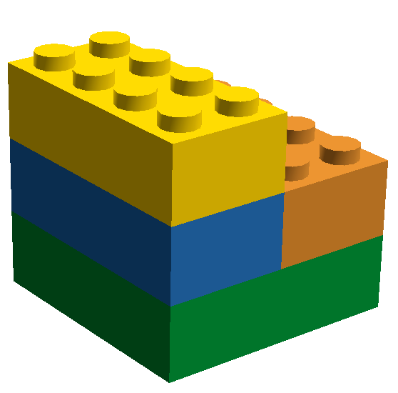

!SLIDE incremental center

* various options to access MongoDB from Scala
* live coding
* more material available at [github.com/olim7t/mongo-scala](http://github.com/olim7t/mongo-scala)

http://www.flickr.com/photos/mikefischer/4267908338/

!SLIDE center
# Libraries overview

!SLIDE center

**mongo-java-driver**

!SLIDE center

**Casbah**: toolkit for better integration with Scala

!SLIDE center

**Salat**: case class ↔ MongoDB mapping

!SLIDE center

**lift-mongodb-record**: Lift's persistence layer

!SLIDE center

**Rogue**: type-safe query DSL
