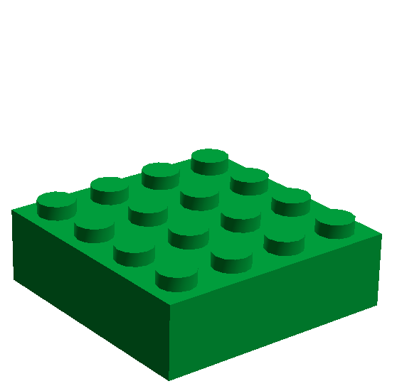
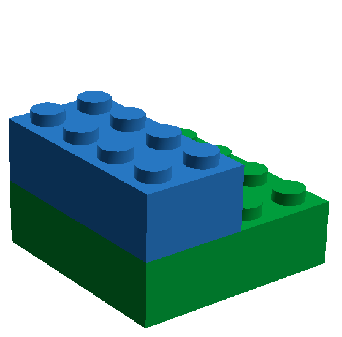
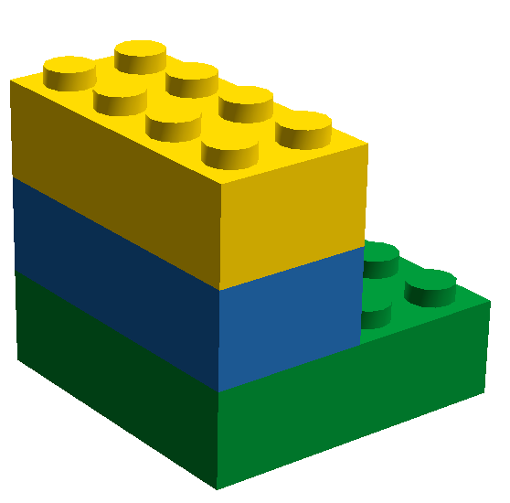
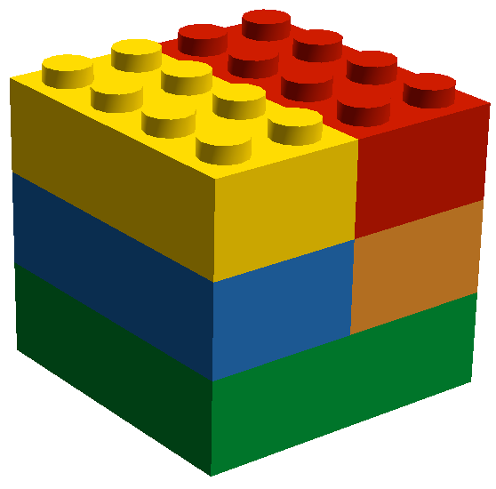

!SLIDE center

#+

!SLIDE subsection
# Contents

* showcase various options to access MongoDB from Scala
* live coding
* more material available at [github.com/olim7t/mongo-scala](http://github.com/olim7t/mongo-scala)

!SLIDE
    @@@scala
    object OlivierMichallat {

      val company = "Xebia"

      val blog = "blog.xebia.fr" +
                 "/author/omichallat"

      val twitter = "@olim7t"

      val github = "github.com/olim7t"
    }

!SLIDE subsection
# MongoDB
> A scalable, high-performance, open source NoSQL database.

* document-oriented (JSON-like structure)
* ad-hoc querying
* replication & auto-sharding

!SLIDE subsection
# Scala
> A general-purpose programmming language designed to express common
programming patterns in a concise, elegant, and type-safe way.

* blends object & functional
* expressive
* runs on the JVM (and .Net)

!SLIDE subsection incremental
# Your experience in Scala?

* use it at work
* use it at home
* never tried

!SLIDE subsection
# Scala refresher

* `Option` type
* case classes

!SLIDE subsection
# `Option` type

Handle optional values

!SLIDE small
    @@@scala
    val capitals = Map(
      "USA" -> "Washington",
      "France" -> "Paris"
    )
    
    
    capitals.get("France")
    // Option[String] = Some(Paris)
    
    
    capitals.get("Nauru")
    // Option[String] = None

!SLIDE small
    @@@scala
    val populations = Map("Washington" -> 5580000)
    // NB: no data for Paris
    
    
    // chain calls - propagate context
    def populationOfCapital(country: String) =
      for {
        capital <- capitals.get(country)
        population <- populations.get(capital)
      } yield population
    
    
    populationOfCapital("USA")
    // Option[Int] = Some(5580000)
    
    populationOfCapital("Nauru")
    // Option[Int] = None
    
    populationOfCapital("France")
    // Option[Int] = None

!SLIDE subsection
# Case classes
Boiler-plate free data classes.

!SLIDE small
    @@@scala
    case class Person(
      firstName: String,
      lastName: String
    )
    
    
    val olivier = Person("Olivier", "Michallat")
    val chuck = Person("Chuck", "Norris")
    
    chuck.lastName // "Norris"
    
    olivier == Person("Olivier", "Michallat") // true
    olivier == chuck // false (unfortunately)

!SLIDE small
    @@@scala
    // Case classes are immutable:
    
    chuck.lastName = "Willis"
    // compiler error: reassignment to val
    
    val chuck2 = chuck.copy(lastName = "Berry")
    chuck2 == chuck // false (compare values)
    chuck2 eq chuck // false (compare references)

!SLIDE subsection
# MongoDB libraries
## Overview

!SLIDE center

**mongo-java-driver**

!SLIDE center

**Casbah**: toolkit for better integration with Scala

!SLIDE center

**Salat**: case class ↔ MongoDB mapping

!SLIDE center

**lift-mongodb-record**: Lift's persistence layer

!SLIDE center

**Rogue**: type-safe query DSL

!SLIDE subsection
#Demo

!SLIDE subsection
#Pro & cons
(IMHO)

!SLIDE

<table>
  <tr>
    <th>Casbah + Salat</th>
    <th>Lift-record + Rogue</th>
  </tr>
  <tr>
    <td>Map to standard Scala case classes (more functional)</td>
    <td>Extend Lift-specific types</td>
  </tr>
  <tr>
    <td>Focuses on object mapping</td>
    <td>Integrates in a full-stack web framework</td>
  </tr>
  <tr>
    <td>Strongly-typed objects</td>
    <td>Strongly-typed objects, typesafe queries with Rogue</td>
  </tr>
  <tr>
    <td>Less forgiving of unexpected schema changes</td>
    <td>Handles missing properties</td>
  </tr>
</table>

!SLIDE subsection
#Questions?
